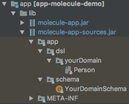

# sbt-molecule
SBT plugin to generate and package Molecule DSL boilerplate code.

## 1. Setup

Add the following to your build files: 

`project/build.properties`:

```scala
sbt.version=1.4.6
```

`project/buildinfo.sbt`:

```scala
addSbtPlugin("org.scalamolecule" % "sbt-molecule" % "0.11.0")
```

`build.sbt`:

```scala
lazy val yourProject = project.in(file("app"))
  .enablePlugins(MoleculePlugin)
  .settings(
    resolvers ++= Seq(
      "datomic" at "http://files.datomic.com/maven",
      "clojars" at "http://clojars.org/repo",
      Resolver.sonatypeRepo("releases")
    ),
    libraryDependencies ++= Seq(
      "org.scalamolecule" %% "molecule" % "0.23.0",
      "com.datomic" % "datomic-free" % "0.9.5697"
    ),
    moleculeSchemas := Seq("app") // paths to your schema definition files...
  )
```
The sbt-molecule plugin is available in [maven central](https://repo1.maven.org/maven2/org/scalamolecule/sbt-molecule_2.12_1.0/) for Scala.


### Tell sbt about your Schema definition files

A Schema definition file contains a plain Scala object where you define partitions/namespaces/attributes of your Datomic database. The MoleculePlugin uses the information defined there to create all the boilerplate code needed to use Molecule in your code.

You can have several Schema definition files in a project. Each definition file defines a single database. This is useful if you for instance want to experiment with various database designs during development.

Schema definiton files should reside in directories named `schema` anywhere in your source code.

Use the `moleculeSchemas` sbt settings key to list the directories in your project source code that contains your `schema` directories.

Say you have a project `demo` and a single Schema definition file `YourDomainDefinition.scala` defining your database:


Then you simply add `moleculeSchemas := Seq("demo")` as we saw above.

In the main Molecule project's examples module we have several Schema definition files:


And we then list the paths to those like this in our `build.sbt`:

```scala
moleculeSchemas := Seq(
  "molecule/examples/dayOfDatomic",
  "molecule/examples/graph",
  "molecule/examples/mbrainz",
  "molecule/examples/seattle"
)
```

### Additional options

If you have several schema definitions you can choose to defer creating jars for the generated code. This way, changes to one definition will only affect compilation time of the files for that schema which can make your `sbt compile` faster.
```scala
moleculeMakeJars := false // (default: true)
```
Then when your schema stabilizes you can set `moleculeMakeJars` back to true again and have jars created from generated code.

All attribute definitions are by default set to be defined being indexed. If you want to manually choose which attributes to index (in your Schema Definition file for each attribute) you can switch this option off:

```scala
moleculeAllIndexed := false // (default: true)
```


## 2. Compile

Now compile your project from the terminal

```
> cd yourProjectRoot
> sbt compile
```

The MoleculePlugin will now automatically as part of the compilation process do 5 things:

1. Generate Molecule boilerplate dsl source code files (in the `src_managed` directory in target)
2. Generate a schema file with the necessary code to transact the Datomic schema  
3. Compile the generated code
4. Package both the source code and compiled classes into two `jar`s and place them in the `lib` directory of your module
5. Remove the generated source code and compiled classes

The MoleculePlugin creates the `jars` so that you can use the boilerplate code without having to recompile any generated boilerplate code each time you recompile your project. In our demo example two jars are created:




## 3. Use

Having the necessary Molecule boilerplate code we can now create our Datomic database with our new Schema:

```scala
import molecule.api.out5._ // or other molecule arity needed
implicit val conn = recreateDbFrom(app.schema.YourDomainSchema)
```

... and start using Molecule

```scala
import app.dsl.yourDomain._

// Insert data
Person.name("John").age(26).gender("male").save

// Retrieve data
val (person, age, gender) = Person.name.age.gender.get.head
```

Read more on [scalamolecule.org](http://www.scalamolecule.org)