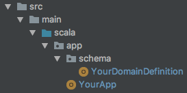
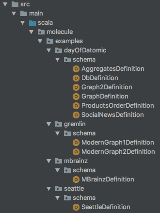
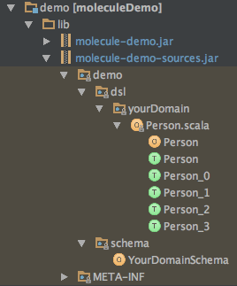

# sbt-molecule
SBT plugin to generate and package Molecule DSL boilerplate code.

## 1. Setup

Add the following to your build files: 

`project/build.properties`:

```scala
sbt.version=0.13.13
```

`project/buildinfo.sbt`:

```scala
addSbtPlugin("org.scalamolecule" % "sbt-molecule" % "0.3.3")
```

`build.sbt`:

```scala
lazy val yourProject = project.in(file("demo"))
  .enablePlugins(MoleculePlugin)
  .settings(
    resolvers ++= Seq(
      "datomic" at "http://files.datomic.com/maven",
      "clojars" at "http://clojars.org/repo",
      Resolver.sonatypeRepo("releases"),
      "Scalaz Bintray Repo" at "http://dl.bintray.com/scalaz/releases"
    ),
    libraryDependencies ++= Seq(
      "org.scalamolecule" %% "molecule" % "0.11.0",
      "com.datomic" % "datomic-free" % "0.9.5561"
    ),
    moleculeSchemas := Seq("demo") // paths to your schema definition files...
  )
```

### Tell sbt about your Schema definition files

A Schema definition file contains a plain Scala object where you define 
partitions/namespaces/attributes of your Datomic database. The MoleculePlugin uses the information
defined there to create all the boilerplate code needed to use Molecule in your code.

You can have several Schema definition files in a project. Each definition file defines a single database. 
This is useful if you for instance want to experiment with various database designs during development.

Schema definiton files should reside in directories named `schema` anywhere in your source code.

Use the `moleculeSchemas` sbt settings key to list the directories in your project source
code that contains your `schema` directories.

Say you have a project `demo` and a single Schema definition file `YourDomainDefinition.scala`
defining your database:



Then you simply add `moleculeSchemas := Seq("demo")` as we saw above.

In the main Molecule project's examples module we have several Schema definition files:



And we then list the paths to those like this in our `build.sbt`:

```scala
moleculeSchemas := Seq(
  "molecule/examples/dayOfDatomic",
  "molecule/examples/graph",
  "molecule/examples/mbrainz",
  "molecule/examples/seattle"
)
```

If your namespaces grow very big, you can add the following setting 

```scala
moleculeSeparateInFiles := true
```
This tells the MoleculePlugin to split the generated boilerplate code into smaller files. It doesn't 
affect your code but could help compilation. For smaller projects you might want to set the setting to
false or simply omit it (it defaults to false) so that all boilerplate traits for each namespace
resides in one file which can make it easier to overview when looking in the file view of your IDE.


## 2. Compile

Now compile your project from the terminal

```
> cd yourProjectRoot
> sbt compile
```

The MoleculePlugin will now automatically as part of the compilation process do 5 things:

1. Generate Molecule boilerplate dsl source code files (in the `src_managed` directory in target)
2. Generate a schema file with the necessary code to transact the Datomic schema  
3. Compile the generated code
4. Package both the source code and compiled classes into two `jar`s and place them in the `lib` directory of your module
5. Remove the generated source code and compiled classes

The MoleculePlugin create the `jars` so that you can use the boilerplate code without having to recompile any 
generated boilerplate code each time you recompile your project. In our demo example two jars are created:




## 3. Use Molecule!

Having the necessary Molecule boilerplate code we can now create our Datomic database with our new Schema:

```scala
import molecule._
implicit val conn = recreateDbFrom(demo.schema.YourDomainSchema)
```

... and start using Molecule

```scala
import demo.dsl.yourDomain._

// Insert data
Person.name("John").age(26).gender("male").add

// Retrieve data
val (person, age, gender) = Person.name.age.gender.one
```

Read more on [scalamolecule.org](http://www.scalamolecule.org)